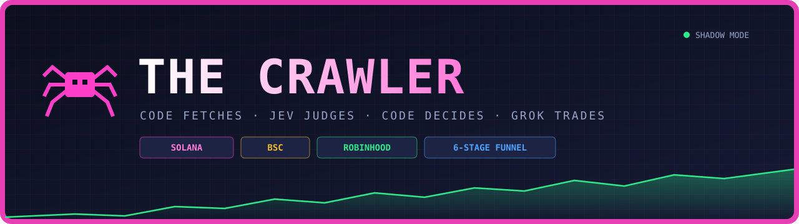
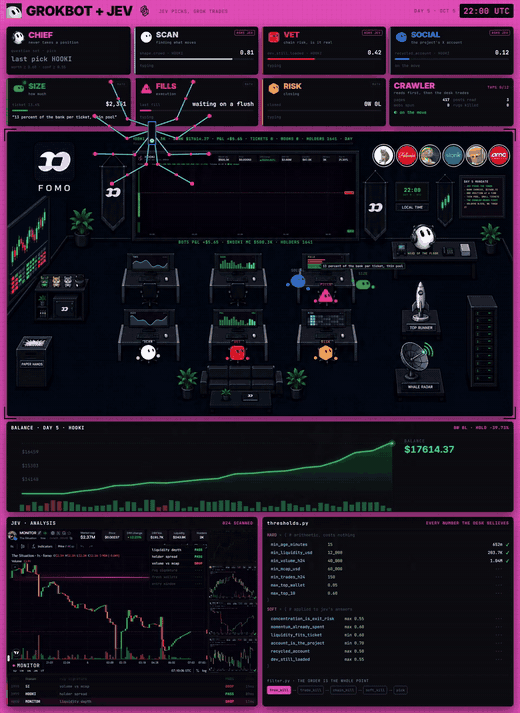
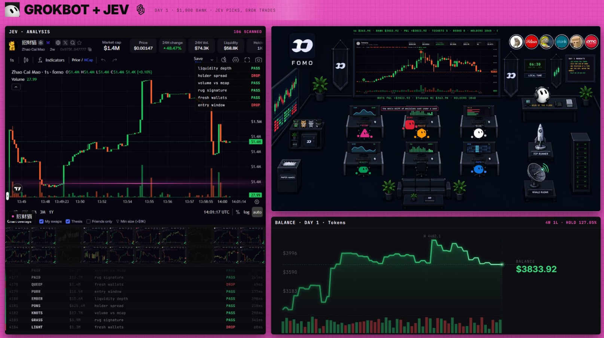
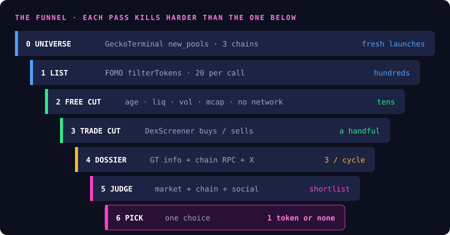
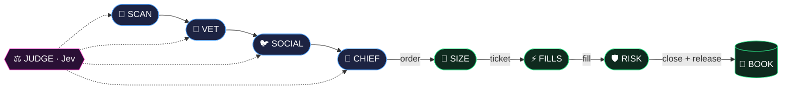

<div align="center">



<br/>


**A memecoin scanning desk that turns every judgement into a typed number with a probability on it.**
<br/>
Code fetches the data. Jev judges it. Code makes the call. Grok Bot places the trade.

[Demo](#-the-desk-in-action) · [How it works](#-how-it-works) · [Quick start](#-quick-start) · [The seats](#-the-seats) · [Files](#-repo-layout)

</div>

---

## The desk in action

<div align="center">

<a href="assets/demo.mp4">
  
</a>

<sub>▶ Click the preview for the full video (<code>assets/demo.mp4</code>)</sub>

<br/><br/>



<sub>Day 1 dashboard: Jev's checks on the left, the Grok Bot floor on the right, balance below.</sub>

</div>

---

## How it works

<div align="center">

</div>

Every pass costs more than the one above it, so every pass has to kill harder. The free cut reads only what came back in the FOMO batch, so it touches no network at all. Only survivors earn a DexScreener call, and only those earn one of the three GeckoTerminal dossier slots per cycle.

The judge answers with exactly three kinds of question:

| Type | Asks | Returns | Acts like |
|:--:|---|---|:--:|
| 🟢 `noul` | Is this true? | probability 0 → 1 | `if` |
| 🔵 `choice` | Which one? (≤ 255 options) | choice + probabilities + confidence | `switch` |
| 🟡 `score` | Rate on my rubric (≤ 10 levels) | score + probabilities + confidence | `sort` |

> **The split to hold onto:** Jev takes the judgements, code takes the arithmetic. Every number is computed *before* the call and passed in as a field.

---

## 🪑 The seats



| Seat | Job | Calls the judge? |
|---|---|:--:|
|  **SCAN** | Pulls the universe and runs the cheap cuts | ✅ |
|  **VET** | Builds the dossier, routes the chain-specific question set | ✅ |
|  **SOCIAL** | Reads the on-chain X handle with Grok's plugin, never searches for one | ✅ |
|  **CHIEF** | Runs the final pick and posts the order | ✅ |
|  **SIZE** | Kelly sizing, 6% cap, 2%-of-pool cap, fee floor | ❌ arithmetic only |
|  **FILLS** | One market order, one venue | ❌ arithmetic only |
|  **RISK** | Closes when 6h volume falls under 20% of average. Overrules everyone | ❌ arithmetic only |

---

##  Quick start

```bash
# 1. install (python 3.10+)
pip install -r requirements.txt
cp .env.example .env          # fill it in, then export the vars

# 2. prove the key works before anything else
./scripts/test_key.sh

# 3. start the judge and tunnel it to the bots
export DESK_SECRET="$(openssl rand -hex 24)"
./scripts/run_judge.sh

# 4. prove the link from a bot's own terminal
./scripts/test_judge_link.sh

# 5. run the shift (shadow mode by default)
python main.py
```

> [!IMPORTANT]
> `main.py` starts in **shadow mode**: it does everything except send the order. Leave it there for at least a week and read the rows in `shadow_log.jsonl` where the desk disagrees with you. That is where your thresholds come from. Flip with `SHADOW=0`.

---

##  Repo layout

```
the-crawler/
├── judge.py            ⚖️  FastAPI service, the only holder of the TypeSafe key
├── judge_client.py     🔌  how every seat reaches the judge
├── questions.py        ❓  every question set: market, solana, bsc, robinhood, social, pick
├── collect.py          🕸️  universe → shortlist → trade counts → dossier
├── thresholds.py       🎚️  every number on the desk. retune here only
├── filter.py           🧹  free_kill → trade_kill → chain_kill → soft_kill
├── pick.py             🎯  one choice over the survivors + size factor
├── book.py             📒  one-position guard + rejection bench (SQLite)
├── main.py             🔁  the 15-minute cycle
├── desk.py             🧪  ShadowDesk stand-in for the Grok Bot side
├── fomo_api.py         🚧  stub, see below
├── prompts/            💬  handoff, SOCIAL, SIZE, FILLS, RISK, order sequence
├── scripts/            🛠️  key test, link test, judge launcher
└── assets/             🎨  banner, funnel, dashboard, demo video
```

<details>
<summary><b> What's missing from the original guide</b></summary>
<br/>

- **`fomo_api.Fomo`** is imported by the guide but never shown. `fomo_api.py` is a stub with the interface the rest of the code expects. `token()` raises `NotImplementedError` until you implement it.
- **The Grok Bot side** (`desk.read_x`, `desk.send_to_seats`, Telegram reporting) lives on the bots, not in this repo. `desk.py` gives you a local shadow-mode stand-in.
- **The original six-seat setup** this builds on is a separate post and isn't included.
- **FILLS** in the original guide routes through the author's referral link. Swap in your own in `prompts/fills.md`.

</details>

<details>
<summary><b>⏱️ Rate limits & failure handling</b></summary>
<br/>

| Event | Response |
|---|---|
| 429 GeckoTerminal | Back off a full minute. If it keeps happening, use `universe(pages=1)` for 3 more dossier slots |
| 429 DexScreener | Lower `DEX_BUDGET` in `main.py` |
| 429 / 529 Jev | SDK backs off on its own |
| 422 Jev | Question is malformed. **Never retry.** Stop the cycle |
| Dossier throws | Skip the token. Not a pass |
| Judge unreachable | Skip the whole cycle. No guessing |
| FOMO bearer expired | Refreshed at the top of every cycle |

</details>

<details>
<summary><b>💸 The bill</b></summary>
<br/>

```
cost_per_call = (state_tokens + question_tokens) / 1_000_000 × $0.042
10 calls × 1,400 tokens  = 14,000 tokens per cycle  ≈ $0.00059
96 cycles a day          ≈ 5.7¢ / day
```

These are the original guide's figures and haven't been independently verified.

</details>

---

<div align="center">

